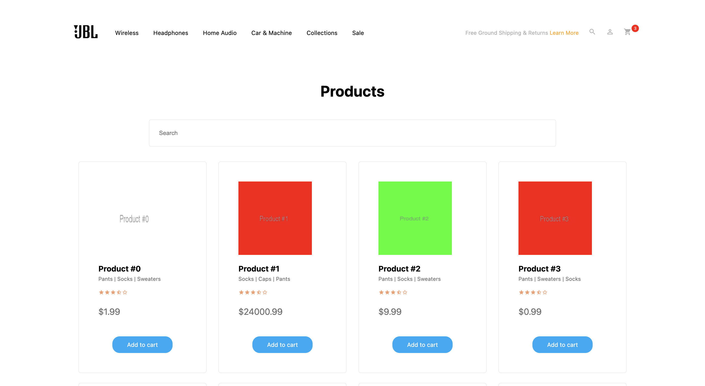

# E-commerce Next.js

This is a [Next.js](https://nextjs.org/) project bootstrapped with [`create-next-app`](https://github.com/vercel/next.js/tree/canary/packages/create-next-app).



## Getting Started

First, run the development server:

```bash
npm run dev
# or
yarn dev
```

Open [http://localhost:3000](http://localhost:3000) with your browser to see the result.

You can start editing the page by modifying `pages/index.js`. The page auto-updates as you edit the file.

## Dependencies

- Typescript
- Styled-components
- React-icons

## API

- /api/products: returns list of products;
- /api/products/:productId: returns detailed information for the product with the specified productId
- /api/products?category=Socks: returns content filtered by category
- /api/products?color=White: returns content filtered by color
- /api/products?size=Large: returns content filtered by size

## TODO

- [x] I can browse a list of all products available in the store.

- [ ] I can filter the products list using Category, Size and Color filters that leverage the API to filter the collection.

- [ ] I can sort the products by price even though the API doesn't provide that functionality.

- [x] Clicking on a product takes me to a Product Detail Page (PDP) with all the info and images for the product.

- [x] I can add a product currently in stock to cart, which is stored locally on my browser.

- [x] I can view products currently in my cart with quantities and price.

## Improvements

- [ ] Responsive version

- [ ] Unit tests

- [ ] Component tests

## How to implement filters using query string

1. Create a filter component with all available filers: Color, Size and Categories.
2. Then, on services > products send as parameter of getProducts: filter and item

```
export function getProducts(filter, item) {
return fetch(`http://localhost:5424/api/products?${filter}=${item}`)
.then(data => data.json())
}
```

## How to implement price filters

1. Create a filter component with price: low to hight and hight to low
2. Create a function to sort data

```
products.sort((a, b) => parseFloat(a.price) - parseFloat(b.price));
```

3. Then return sorted data to the main component ProductsList
